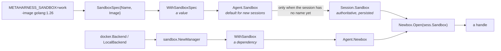
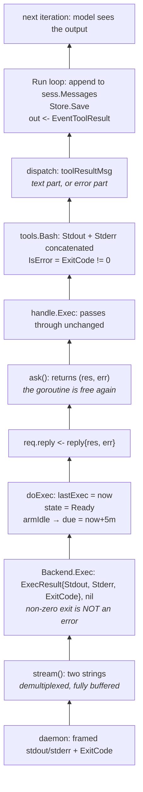
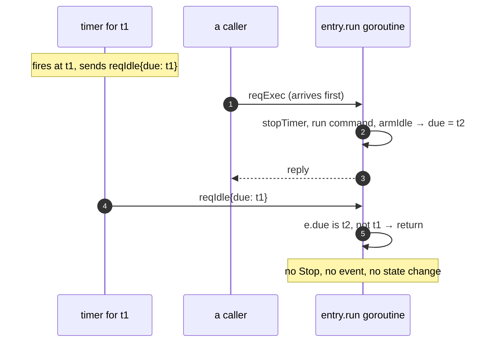
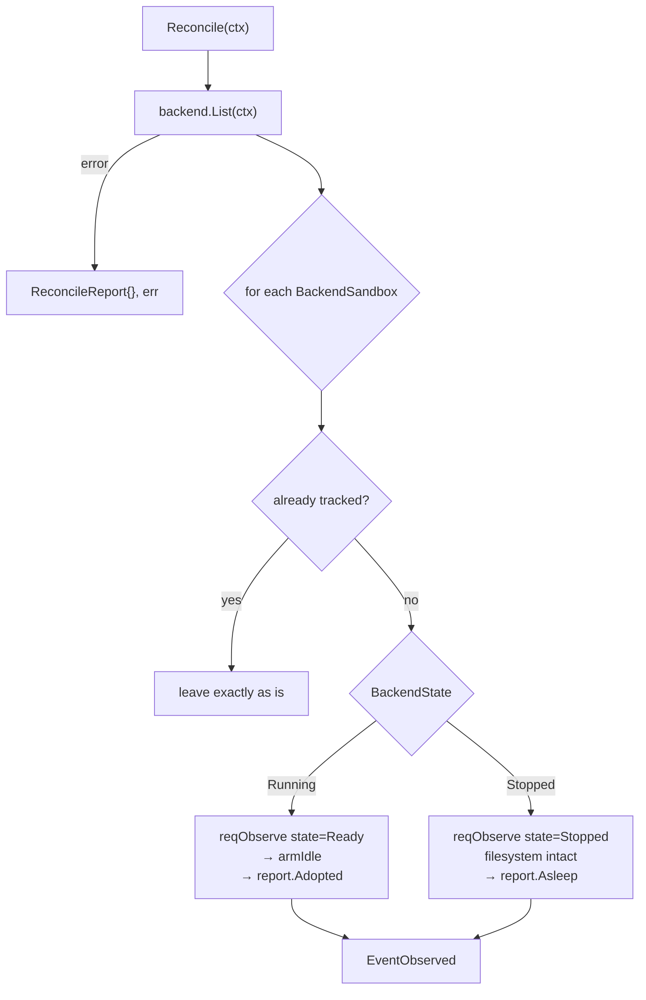
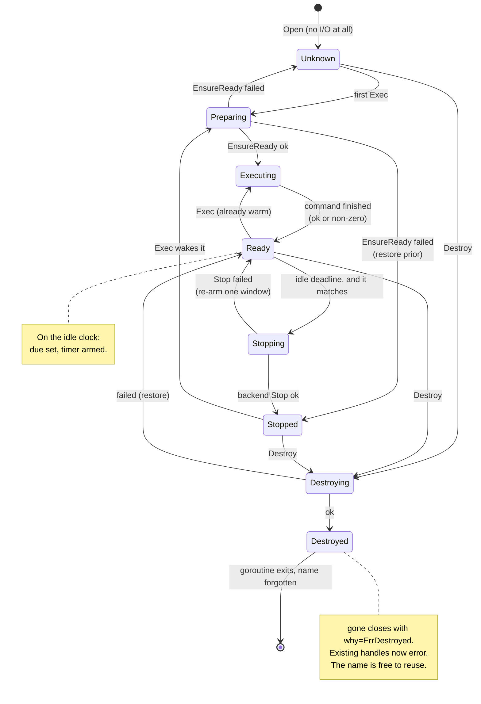

# Following one command into a container and back

This is a walkthrough of the sandbox subsystem, told as a call trace rather than
as a catalogue of types. We start where an application starts — wiring an agent —
and then follow a single `bash -c 'go test ./...'` all the way down until it is
running inside a container, and all the way back up until the model can read the
output. Every frame is real code, quoted from the file it lives in.

If you only read one section, read §2 — it answers the "why do we need both of
these?" question, and the answer is the design in miniature.

---

## 1. The shape, before the details

Three parties, and each one is deliberately ignorant of something.

**The agent** knows there is a thing it can run commands in. It does not know
whether that thing is a container, a directory, or a fake in a test. Its entire
vocabulary is two interfaces, both defined in `agent/sandbox.go` — a package that
imports nothing but `context`:

```go
// Sandbox is a live handle. Never persisted.
type Sandbox interface {
	Exec(ctx context.Context, cmd Command) (ExecResult, error)
	Close() error
}

// SandboxFactory binds a name to a live handle (a sandbox manager in prod, a
// fake in tests). Open does no I/O and starts nothing: the first Exec is what
// creates or wakes the sandbox.
type SandboxFactory interface {
	Open(spec SandboxSpec) (Sandbox, error)
}
```

**The manager** (`sandbox/`) knows about lifecycle: that a sandbox can be asleep,
that waking it takes time, that nobody has touched it for five minutes so its
compute should go away, that a restart means re-learning what exists. It does not
know what a sandbox physically *is*.

**The backend** (`sandbox/docker/`, or `LocalBackend`) knows what a sandbox
physically is and nothing else. Five methods, no policy, no timers, no locks:

```go
type Backend interface {
	EnsureReady(ctx context.Context, spec agent.SandboxSpec) error
	Exec(ctx context.Context, name string, cmd agent.Command) (agent.ExecResult, error)
	Stop(ctx context.Context, name string) error
	Destroy(ctx context.Context, name string) error
	List(ctx context.Context) ([]BackendSandbox, error)
}
```

The slogan version: **the backend owns existence, the manager owns policy, the
handle owns nothing.** The Docker SDK is imported by exactly one package
(`sandbox/docker`), which is why you can build and test the agent loop on a
machine with no daemon.

And one fact that everything else hangs off: **the name is the identity.** Not a
container id, not a handle, not a session — the string `"work"`. The same name is
the same filesystem tomorrow, in another process, after a reboot. Nothing in the
system ever mangles a name into something that would be legal; a name that would
have to be rewritten is rejected instead, because two names quietly becoming one
container would be data loss with no error message.

---

## 2. Why both `WithSandbox` and `WithSandboxSpec`

Here is the wiring from `examples/telegram-chat/main.go`, the two lines in
question:

```go
sandboxes := sandbox.NewManager(opt.backend, sandbox.WithObserver(logSandboxEvent))
defer sandboxes.Close()

a := agent.New(systemPrompt,
	agent.WithModel(m),
	agent.WithSandbox(sandboxes),                 // ← who can mint sandbox handles
	agent.WithSandboxSpec(opt.spec),              // ← which sandbox new sessions get
	agent.WithTools(/* … */),
)
```

They look redundant. They are not, and the cleanest way to see why is to look at
what each one sets on the `Agent` struct (`agent/agent.go:5-15`):

```go
type Agent struct {
	// …
	Newbox SandboxFactory

	// Sandbox is the sandbox new sessions run in. A session that already names
	// one keeps it.
	Sandbox SandboxSpec
}
```

One is an **interface** — a collaborator, a source of capability. The other is a
**struct of two strings** — a value, a default, a piece of configuration:

```go
type SandboxSpec struct {
	Name  string `json:"name"`
	Image string `json:"image"`
}
```

### The question each one answers

| | `WithSandbox(sandboxes)` | `WithSandboxSpec(spec)` |
| --- | --- | --- |
| Answers | *how* do I get a sandbox | *which* sandbox |
| Kind of thing | a dependency (interface) | a value (two strings) |
| Lifetime | the process | the session |
| Substituted by | `testutils.NopFactory{}` in tests, a `Manager` over `LocalBackend` in dev, a `Manager` over `docker.Backend` in prod | an env var, a CLI flag, a per-user setting |
| Overridable per session | no | **yes** |
| Persisted | no — it holds goroutines and a daemon connection | yes — it's a field on `Session` |
| If you forget it | `Run` fails immediately: `"agent not fully wired"` | `Open` fails: `sandbox: a name is required` |

### The load-bearing asymmetry

The last two rows are the real reason there are two options rather than one, and
they show up in four lines at the top of `Agent.Run` (`agent/run.go:42-50`):

```go
// The session records the sandbox it ran in, so resuming it later binds
// the same name and the same filesystem.
if sess.Sandbox.Name == "" {
	sess.Sandbox = a.Sandbox
}
box, err := a.Newbox.Open(sess.Sandbox)
if err != nil {
	a.fail(ctx, sess, out, err)
	return
}
defer box.Close()
```

Read that carefully. `a.Sandbox` — the thing `WithSandboxSpec` set — is used
**only as a default for a session that doesn't have one yet.** A session that was
saved last Tuesday with `Sandbox.Name == "old-work"` gets `old-work` again, no
matter what the agent's spec says today. The spec is a *default for new
sessions*; the session's own copy is authoritative.

`a.Newbox` gets no such treatment. It is used unconditionally, every run,
because it isn't a preference — it's the only way to obtain a `Sandbox` at all.
It also can't be persisted: a `Manager` is a live object holding a goroutine per
sandbox, a set of timers, and (via the backend) a socket to the Docker daemon.
Storing that in a session row is not a thing that means anything.

So: **one is state that travels with the conversation, the other is machinery
that belongs to the process.** They have to be separate because they have
different lifetimes and different override rules.

### Why you can't collapse them either direction

Suppose you tried to fold the name into the factory — `sandbox.NewManager(backend, "work")`
— and dropped `WithSandboxSpec`. Look at what `Open`'s signature would become,
and what breaks:

```go
func (m *Manager) Open(spec agent.SandboxSpec) (agent.Sandbox, error) {
	if spec.Name == "" {
		return nil, ErrNameRequired
	}
	e, err := m.entryFor(spec)   // ← the name is a *parameter*, deliberately
	// …
}
```

The name being a parameter is what lets one `Manager` hold many sandboxes. That
one manager is where the shared idle policy lives, where `Reconcile` runs once at
startup for everything, and where `Close` drains everything. A manager per
sandbox would mean an idle timeout configured N times, N reconcile passes, N
things to shut down — and no single place that could answer "what sandboxes does
this process have?" (`Inspect`).

It's also what makes sharing work. Two sessions opened with the same name don't
get two sandboxes; `entryFor` returns the *same* `entry`, so they get two handles
onto one sandbox and their commands serialize behind one goroutine:

```go
// entryFor returns the one entry for spec.Name, creating it on first sight. An
// existing entry wins: once a name is known, its spec is authoritative.
func (m *Manager) entryFor(spec agent.SandboxSpec) (*entry, error) {
	e, _, err := m.adopt(spec)
	return e, err
}
```

Now the other direction: suppose the agent held only a spec and constructed its
own sandbox from it. Then `agent` would need to know how to build a Docker
backend — the `agent` package would import the Docker SDK, and every test of the
agent loop would need a daemon. Instead `agent` depends on an interface it
defines itself, and `testutils.NopFactory` satisfies it in four lines.

### Both, together, in one sentence

`WithSandbox` says *sandboxes come from here*; `WithSandboxSpec` says *and unless
a session says otherwise, use the one called this*. Which sandbox to work in is
an application decision — read from `METAHARNESS_SANDBOX` in the example — and the
library never invents one.



Both arrows have to meet at `Open`. That's the whole answer: one supplies the
verb, the other supplies the noun.

---

## 3. The descent: one `bash` call, frame by frame

Now the main event. The model has just emitted a tool call:

```json
{"name": "bash", "input": {"cmd": "go test ./..."}}
```

We're going to follow it down eight frames until it's running in a container.
Here's the map; the sections below are the frames.

```mermaid
sequenceDiagram
    autonumber
    participant L as Agent.Run loop
    participant T as tools.Bash
    participant H as handle
    participant E as entry.run goroutine
    participant B as docker.Backend
    participant D as daemon

    L->>T: dispatch → Execute(ExecCtx{Sandbox: box}, args)
    T->>H: ec.Sandbox.Exec(ctx, Command{"bash", "-c", cmd})
    H->>E: ask(request{kind: reqExec}) — unbuffered send
    Note over E: takes the request; nothing else runs<br/>for this sandbox until it replies
    E->>B: EnsureReady(ctx, spec)
    B->>D: ContainerInspect / ImagePull / ContainerCreate / ContainerStart
    D-->>B: ok
    B-->>E: nil
    E->>B: Exec(ctx, name, cmd)
    B->>D: ContainerExecCreate + ExecAttach
    D-->>B: stdout/stderr frames, then EOF
    B->>D: ContainerExecInspect → ExitCode
    B-->>E: ExecResult{out, err, code}, nil
    E->>E: lastExec = now; state = Ready; armIdle
    E-->>H: reply{res, err}
    H-->>T: ExecResult
    T-->>L: ToolResult{Content, IsError}
    L->>L: append tool message, Store.Save, emit EventToolResult
```

### Frame 1 — `Agent.Run` sees tool calls

The loop is a switch over "what is the last message" (`agent/run.go:52-98`).
Assistant message with tool-call parts in it? Run them:

```go
last := lastMessage(sess)
calls := toolCalls(last)

switch {
case calls != nil: // assistant asked for tools
	for _, c := range calls {
		res := a.dispatch(ctx, sess, box, c)
		sess.Messages = append(sess.Messages, res)
		out <- Event{Type: EventToolResult, Message: &res}
	}
	if err := a.Store.Save(ctx, sess); err != nil {
		a.fail(ctx, sess, out, err)
		return
	}
```

Note `box` — the handle opened once at the top of the run, before the loop, and
closed with `defer box.Close()` when the run ends. One handle for the whole run,
passed down into every tool call.

### Frame 2 — `dispatch` hands the sandbox to the tool

```go
func (a *Agent) dispatch(ctx context.Context, sess *Session, box Sandbox, call fantasy.ToolCallPart) fantasy.Message {
	t, ok := a.Tools[call.ToolName]
	if !ok {
		return toolResultMsg(call.ToolCallID, "unknown tool: "+call.ToolName, true)
	}
	res, err := t.Execute(ctx, &ExecCtx{Session: sess, Sandbox: box}, json.RawMessage(call.Input))
	if err != nil {
		return toolResultMsg(call.ToolCallID, err.Error(), true)
	}
	return toolResultMsg(call.ToolCallID, res.Content, res.IsError)
}
```

This is where the sandbox *enters the tool*: `&ExecCtx{Session: sess, Sandbox: box}`.
Tools never construct a sandbox, never look one up, never see a name. They are
handed one at call time and that's their whole access to the outside world.

(Between here and the tool's `Execute` sits `typedAdapter.Execute` in
`agent/adapt.go`, which validates the model's JSON against the schema derived
from the tool's argument type and decodes it. It passes `ec` straight through
untouched — worth knowing it's there, not worth a frame.)

### Frame 3 — the tool turns intent into a `Command`

All of `tools/bash.go` that matters:

```go
func (Bash) Execute(ctx context.Context, ec *agent.ExecCtx, args BashArgs) (agent.ToolResult, error) {
	res, err := ec.Sandbox.Exec(ctx, agent.Command{Cmd: "bash", Args: []string{"-c", args.Cmd}})
	if err != nil {
		return agent.ToolResult{}, err // infra failure -> fatal
	}
	out := res.Stdout
	if res.Stderr != "" {
		out += "\n" + res.Stderr
	}
	return agent.ToolResult{Content: out, IsError: res.ExitCode != 0}, nil
}
```

Two things are decided in six lines, and they're the contract the whole stack is
built to make possible:

- **a non-zero exit code is `IsError: true` content** — the model gets to read the
  failure and try something else;
- **a non-nil error is returned up as a Go error** — the sandbox itself is
  reporting that the command never ran or its outcome can't be established.

A failing `go test` must never look like a broken sandbox. Hold that thought;
Frame 8 is where it gets enforced at the bottom of the stack.

(The `// infra failure -> fatal` comment on that line overstates what happens:
`dispatch` catches the error one frame up and feeds it back to the model as an
error result. See §4, and §13.)

### Frame 4 — `handle.Exec`: a reference, not a sandbox

`ec.Sandbox` is a `*sandbox.handle`, and it is almost nothing (`sandbox/handle.go`):

```go
type handle struct {
	entry  *entry
	closed atomic.Bool
}

func (h *handle) Exec(ctx context.Context, cmd agent.Command) (agent.ExecResult, error) {
	if h.closed.Load() {
		return agent.ExecResult{}, ErrClosed
	}
	return h.entry.ask(request{kind: reqExec, ctx: ctx, cmd: cmd})
}

// Close releases this handle. It is idempotent and has no lifecycle effect.
func (h *handle) Close() error {
	h.closed.Store(true)
	return nil
}
```

That's the entire type. It wraps the caller's `ctx` and command into a `request`
and hands it to the goroutine — no state, no logic, no lifecycle.

The important non-event here is `Close`. It flips a bool. It does not stop the
container, does not decrement a refcount, does not tell anyone. That's why
`defer box.Close()` at the top of `Run` is safe: **an agent run ending never takes
the sandbox with it.** The handle is a reference; the sandbox outlives it. There
is also, deliberately, no reference counting anywhere — nothing knows how many
callers are live, and idle time is the only signal that nobody is using a
sandbox.

### Frame 5 — `ask`: crossing into the goroutine

This is the seam where a normal function call becomes a message to an actor
(`sandbox/manager.go:316-325`):

```go
// ask hands one request to the goroutine and waits for its answer. A sandbox
// whose goroutine has already exited answers immediately, with the reason it
// exited: a destroyed sandbox is ErrDestroyed and a closed manager ErrShutdown.
func (e *entry) ask(req request) (agent.ExecResult, error) {
	req.reply = make(chan reply, 1)
	select {
	case e.reqs <- req:
	case <-e.gone:
		return agent.ExecResult{}, e.why
	}
	rep := <-req.reply
	return rep.res, rep.err
}
```

Four design decisions are visible in nine lines:

- **`reqs` is unbuffered.** A send that succeeded is a request the goroutine has
  *taken*, which is why the next line can block on `reply` with no fallback. It's
  also the entire serialization mechanism: one sandbox, one goroutine, one
  request at a time. No mutex anywhere in the lifecycle.
- **`gone` is the escape hatch.** A destroyed sandbox has no goroutine to answer,
  so `ask` selects on `gone` and returns the reason the goroutine exited. Handles
  bound to a destroyed name get `ErrDestroyed` without anything having to stay
  alive to tell them.
- **the reply channel is buffered (1) and per-request**, so the goroutine's
  `req.reply <- reply{…}` never blocks even if the caller has wandered off.
- **every request the goroutine takes is answered exactly once.** That invariant
  is what makes the `<-req.reply` safe, and it's why `doIdle` replies via
  `defer`.

### Frame 6 — the goroutine: `run` → `serve` → `doExec`

The actor loop is eight lines and there is nothing else it does:

```go
func (e *entry) run() {
	for {
		select {
		case req := <-e.reqs:
			if e.serve(req) {
				e.exit(ErrDestroyed)
				return
			}
		case <-e.mgr.closing:
			e.exit(ErrShutdown)
			return
		}
	}
}
```

`serve` is a switch on `req.kind` (`reqExec`, `reqIdle`, `reqDestroy`,
`reqObserve`) dispatching to one `do*` method each. Ours is `doExec`
(`manager.go:368-397`), the heart of the whole subsystem:

```go
func (e *entry) doExec(req request) {
	e.stopTimer()

	prior := e.state
	if prior != StateReady {
		e.commit(StatePreparing)
		if err := e.mgr.backend.EnsureReady(req.ctx, e.spec); err != nil {
			// Back to the stable state the failure left it in. […]
			e.commit(prior)
			e.emit(EventPrepareFailed, StatePreparing, prior, err)
			req.reply <- reply{err: err}
			return
		}
		e.commit(StateExecuting)
		e.emit(EventPrepared, StatePreparing, StateExecuting, nil)
	} else {
		e.commit(StateExecuting)
	}

	res, err := e.mgr.backend.Exec(req.ctx, e.spec.Name, req.cmd)

	// A command that failed still counts as use: the sandbox is running either
	// way, and the caller decides what to do about the error.
	e.lastExec = e.mgr.clock.Now()
	e.commit(StateReady)
	e.armIdle()
	req.reply <- reply{res: res, err: err}
}
```

Read top to bottom, this is the entire lifecycle policy:

1. **`stopTimer()` first** — running a command takes the sandbox off the idle
   clock. Whatever deadline was pending is dropped, along with any wakeup already
   in flight for it.
2. **`prior != StateReady` is the "might need to wake or create" branch.** On the
   very first command `prior` is `StateUnknown`, because `Open` did no I/O at all.
   This is where a container gets created, or a stopped one started — and note
   that from the caller's side it is invisible: they called `Exec`, and whether
   that meant pulling a 900 MB image or nothing at all is not their problem.
3. **`commit` publishes state as it changes**, so an operator calling `Inspect`
   while this is happening sees `preparing`, then `executing` — not a stale
   `ready`.
4. **failure restores the prior state and says where it landed.**
   `EventPrepareFailed` carries `From: preparing, To: prior`, so an observer
   learns not just that it failed but where the next command will start from.
5. **`lastExec` and `armIdle()` run regardless of `err`.** A command that exited
   99 still used the sandbox; the sandbox is running either way; the clock starts
   again either way.

### Frame 7 — `EnsureReady`: making a container exist

Into `sandbox/docker/backend.go:131-149`:

```go
func (b *Backend) EnsureReady(ctx context.Context, spec agent.SandboxSpec) error {
	name, err := b.containerName(spec.Name)
	if err != nil {
		return err
	}

	info, err := b.daemon.ContainerInspect(ctx, name)
	switch {
	case cerrdefs.IsNotFound(err):
		return b.create(ctx, name, spec)
	case err != nil:
		return fmt.Errorf("sandbox/docker: inspecting sandbox %q: %w", spec.Name, err)
	case info.ContainerJSONBase == nil || info.State == nil:
		return fmt.Errorf("sandbox/docker: the daemon reported no state for sandbox %q", spec.Name)
	case info.State.Running:
		return nil                      // ← already there, leave it completely alone
	}
	return b.start(ctx, name, spec.Name)  // ← stopped: start it, same filesystem
}
```

`containerName` is where the name-is-identity rule is enforced:

```go
var usableName = regexp.MustCompile(`^[a-zA-Z0-9][a-zA-Z0-9_.-]*$`)

func (b *Backend) containerName(name string) (string, error) {
	if !usableName.MatchString(name) {
		return "", fmt.Errorf("sandbox/docker: %q is not a usable sandbox name: […]", name)
	}
	return b.container(name), nil  // "metaharness-sandbox-" + name
}
```

Rejected, never sanitised. `LocalBackend.dir` takes exactly the same posture for
the same reason — a name containing a separator, a `..`, or an absolute path is
an error, not something to resolve into a directory somewhere surprising.

The `create` path only runs when nothing exists under that name:

```go
func (b *Backend) create(ctx context.Context, name string, spec agent.SandboxSpec) error {
	if spec.Image == "" {
		return fmt.Errorf("sandbox/docker: sandbox %q does not exist and the spec has no image to create it from", spec.Name)
	}
	if err := b.ensureImage(ctx, spec.Image); err != nil {
		return err
	}

	immediately := 0
	config := &container.Config{
		Image:       spec.Image,
		Entrypoint:  b.keepalive,          // tail -f /dev/null
		WorkingDir:  b.workdir,            // /workspace
		Labels:      map[string]string{Label: spec.Name},
		StopTimeout: &immediately,
	}
	if _, err := b.daemon.ContainerCreate(ctx, config, &container.HostConfig{}, nil, nil, name); err != nil {
		return fmt.Errorf("sandbox/docker: creating sandbox %q: %w", spec.Name, err)
	}
	return b.start(ctx, name, spec.Name)
}
```

This is where `SandboxSpec.Image` finally gets used — and where you can see why
its doc says "creation configuration". Once a container exists under that name,
`EnsureReady` returns at `info.State.Running` or calls `start`, and the image
field is never looked at again. **Bumping the image in your spec does nothing to
an existing sandbox**, silently — no event, no error. That's the right semantics
(recreating would take the filesystem with it) but it's a real gotcha.

Four small decisions worth knowing about:

| Decision | Why |
| --- | --- |
| `tail -f /dev/null` as the keepalive, not `sleep infinity` | `sleep` only understands `infinity` in GNU coreutils. Busybox `sleep` in Alpine would exit immediately and take the sandbox with it. |
| Keepalive replaces the image's `Entrypoint` | A sandbox exists to run commands on request; whatever the image would otherwise start has nothing to do with that. |
| `StopTimeout: 0` at create *and* at `Stop` | The keepalive is PID 1 with no signal handler, so the kernel never delivers SIGTERM to it. A graceful timeout would always be spent in full. Recording it on the container makes even a hand-run `docker rm -f` immediate. |
| Ownership is the **label**, not the name prefix | `List` filters on `label=metaharness.sandbox`, so a container that merely shares the naming convention is left alone. Also means `docker ps --all --filter label=metaharness.sandbox` shows you your sandboxes. |

And the pull, which is subtler than it looks:

```go
body, err := b.daemon.ImagePull(ctx, ref, image.PullOptions{})
// …
defer body.Close()

// The pull happens as its progress stream is read, so reading that stream to
// the end is what waits for the image to actually be there.
if _, err := io.Copy(io.Discard, body); err != nil {
	return fmt.Errorf("sandbox/docker: pulling image %q: %w", ref, err)
}
```

`ImagePull` returns as soon as the request is accepted. Draining the progress
stream is the only thing that means "the image has landed".

### Frame 8 — `Backend.Exec`: the command runs

`sandbox/docker/executor.go`. Three daemon calls, in a specific order, for a
specific reason:

```go
func (b *Backend) Exec(ctx context.Context, name string, cmd agent.Command) (agent.ExecResult, error) {
	cname, err := b.containerName(name)
	if err != nil {
		return agent.ExecResult{}, err
	}

	created, err := b.daemon.ContainerExecCreate(ctx, cname, container.ExecOptions{
		Cmd:          append([]string{cmd.Cmd}, cmd.Args...),
		WorkingDir:   b.workdir,
		AttachStdout: true,
		AttachStderr: true,
	})
	if err != nil {
		return agent.ExecResult{}, fmt.Errorf("sandbox/docker: starting a command in sandbox %q: %w", name, err)
	}

	stdout, stderr, err := b.stream(ctx, created.ID)
	if err != nil {
		return agent.ExecResult{}, fmt.Errorf("sandbox/docker: running a command in sandbox %q: %w", name, err)
	}

	// The exit status is only final once the output has ended, so it is read
	// after the stream has been drained rather than alongside it.
	finished, err := b.daemon.ContainerExecInspect(ctx, created.ID)
	if err != nil {
		return agent.ExecResult{}, fmt.Errorf("sandbox/docker: reading the outcome of a command in sandbox %q: %w", name, err)
	}
	if finished.Running {
		return agent.ExecResult{}, fmt.Errorf("sandbox/docker: no exit status for a command in sandbox %q: its output ended but the daemon still reports it running", name)
	}

	return agent.ExecResult{Stdout: stdout, Stderr: stderr, ExitCode: finished.ExitCode}, nil
}
```

Notice that `finished.Running` is an **error**, not a guessed exit code. If the
daemon can't tell us how the command ended, we say so rather than invent a zero.
That's the contract from Frame 3, defended at the bottom of the stack: an error
means "the outcome could not be established", and the agent loop is entitled to
treat it as fatal.

`stream` is the fiddly one, because a read blocked on the daemon does not notice
a cancelled context:

```go
func (b *Backend) stream(ctx context.Context, execID string) (stdout, stderr string, err error) {
	attached, err := b.daemon.ContainerExecAttach(ctx, execID, container.ExecAttachOptions{})
	// … nil-check Conn and Reader …
	defer attached.Close()

	var out, errOut bytes.Buffer
	copied := make(chan error, 1)
	go func() {
		_, err := stdcopy.StdCopy(&out, &errOut, attached.Reader)
		copied <- err
	}()

	select {
	case err := <-copied:
		if err != nil {
			return "", "", err
		}
	case <-ctx.Done():
		// Closing the connection is what unblocks the read; waiting for the copy
		// to return afterwards is what makes the buffers nobody else's business.
		attached.Close()
		<-copied
		return "", "", ctx.Err()
	}
	return out.String(), errOut.String(), nil
}
```

Two things earn their keep here. `stdcopy.StdCopy` demultiplexes stdout and
stderr, which the daemon interleaves down one connection in framed chunks — that
is why you can't just `io.Copy` and why there are tests for output split across
frames. And the cancellation path closes the connection *and then waits for the
copy goroutine to return*, so nothing is still writing into `out`/`errOut` when
the function returns. That `<-copied` is what keeps the race detector quiet.

---

## 4. The return path

Now back up, and the interesting part is what each frame *changes* on the way.



The three transformations that actually matter:

**`doExec` re-arms the clock before it replies.** Look at the order again:

```go
e.lastExec = e.mgr.clock.Now()
e.commit(StateReady)
e.armIdle()
req.reply <- reply{res: res, err: err}
```

The sandbox is back on the idle clock, and its state is published as `ready`,
*before* the caller is told anything. There is no window where the command is
finished but the sandbox is unaccounted for. And the moment that reply is sent
the goroutine returns to its `select`, so the next queued command — or the next
idle wakeup — is taken immediately.

**`tools.Bash` collapses two streams and one integer into a string and a bool.**

```go
out := res.Stdout
if res.Stderr != "" {
	out += "\n" + res.Stderr
}
return agent.ToolResult{Content: out, IsError: res.ExitCode != 0}, nil
```

This is where "exit code 1" becomes "the model should see this as a failed tool
call, and keep going".

**`toolResultMsg` picks the message shape from that bool** (`agent/run.go:146-159`):

```go
var output fantasy.ToolResultOutputContent
if isErr {
	output = fantasy.ToolResultOutputContentError{Error: errors.New(content)}
} else {
	output = fantasy.ToolResultOutputContentText{Text: content}
}
```

And then the loop appends it, saves the session, emits `EventToolResult` to the
application, and comes round again. If there were three tool calls in that
assistant message, frames 2-8 just happened three times, sequentially, through
the same handle.

Worth stating plainly, because the code comments here are misleading:
**`ExitCode: 1` and `err != nil` end up in almost the same place.** Follow the
error path. `Bash.Execute` returns `agent.ToolResult{}, err` with a comment
saying `// infra failure -> fatal`. But one frame up, `dispatch` does this
(`run.go:112-116`):

```go
res, err := t.Execute(ctx, &ExecCtx{Session: sess, Sandbox: box}, json.RawMessage(call.Input))
if err != nil {
	return toolResultMsg(call.ToolCallID, err.Error(), true)
}
return toolResultMsg(call.ToolCallID, res.Content, res.IsError)
```

Both branches produce a tool message. A dead daemon becomes
`ToolResultOutputContentError{Error: "sandbox/docker: …"}` fed back to the model,
which will cheerfully retry `go test` against a sandbox that no longer exists.
The loop is not stopped, and `dispatch`'s own doc comment says as much: *"A tool
returning an error becomes an error result fed back to the model, NOT a fatal
stop."* Two comments in two files, disagreeing, one frame apart.

The genuinely fatal paths are elsewhere: `a.fail(...)`, called when `Open` itself
fails, when the model errors, when the store errors, or when `ctx` is cancelled.
That sets `StatusFailed`, emits `EventError`, and returns — closing the event
channel.

---

## 5. The second command is boring, and that's the point

Same trace, one branch different. `prior` is now `StateReady`, so:

```go
prior := e.state
if prior != StateReady {
	// … EnsureReady, create/start, events …
} else {
	e.commit(StateExecuting)   // ← this is the whole fast path
}
```

No daemon inspect, no start, no event. `stopTimer` → `commit(executing)` →
`backend.Exec` → `armIdle` → reply. The cost of a warm sandbox is one exec
against a running container, which is the reason for the long-lived keepalive
container in the first place: *not* one container per command.

---

## 6. Five minutes later, with nobody home

Here's the part with no caller in it. The sandbox has been sitting in `Ready`
since that `go test`, and `armIdle` scheduled something (`manager.go:464-476`):

```go
func (e *entry) armIdle() {
	e.stopTimer()
	if e.mgr.idle <= 0 {
		return                       // WithIdleTimeout(0) — no timer at all, ever
	}
	e.due = e.mgr.clock.Now().Add(e.mgr.idle)
	e.publish()

	due := e.due
	e.timer = e.mgr.clock.AfterFunc(e.mgr.idle, func() {
		e.ask(request{kind: reqIdle, due: due})
	})
}
```

That closure is the whole trick: **the timer is just another caller.** It calls
the same `ask`, sends on the same unbuffered `reqs` channel, and waits for the
same reply. The idle deadline gets no special access to the sandbox's state; it
queues behind whatever is running, exactly like an `Exec` would.

And it carries `due` — the deadline it was scheduled *for*, captured by value.
That's the generation counter, except it isn't a counter, it's the deadline
itself:

```go
func (e *entry) doIdle(req request) {
	defer func() { req.reply <- reply{} }()

	if e.state != StateReady || !req.due.Equal(e.due) {
		return                       // ← stale wakeup: dropped, no side effects
	}
	e.commit(StateStopping)

	// Nobody is waiting on this: stopping idle compute is background work, so it
	// gets the background context.
	if err := e.mgr.backend.Stop(context.Background(), e.spec.Name); err != nil {
		// Keep a sandbox that refused to stop usable, and give it one full idle
		// window before trying again rather than retrying in a tight loop.
		e.commit(StateReady)
		e.armIdle()
		e.emit(EventStopFailed, StateStopping, StateReady, err)
		return
	}
	e.stopTimer()
	e.commit(StateStopped)
	e.emit(EventStopped, StateStopping, StateStopped, nil)
}
```

Four things to take from that:

- **`context.Background()`, deliberately.** There is no caller whose cancellation
  should abort this. Stopping idle compute is the manager's own work.
- **the stale case needs no machinery.** A command arrived at 4m30s? It called
  `stopTimer` (dropping the deadline) and then `armIdle` (setting a new one), so
  when the old wakeup finally lands, `req.due` doesn't equal `e.due` and it
  returns having done nothing. No `Stop`, no event, no state change.
- **a failed stop leaves the sandbox usable** in `Ready` with one full idle
  window before the next attempt — not a retry loop against a sick daemon.
- **the wakeup waits for its answer.** `defer req.reply <- reply{}` fires on
  every path, and `time.AfterFunc` runs the callback on its own goroutine, so
  blocking there costs nothing. What it buys is that a deadline is *synchronous*:
  when the callback returns, the decision has been made and any stop has already
  happened. That's what lets the test suite's `fakeClock.Advance` be a plain
  assertion instead of a polling loop.



The next command after a successful stop takes the `prior != StateReady` branch
again — `prior` is `StateStopped` — so `EnsureReady` inspects, finds a stopped
container, and starts it. Same container, same writable layer, same files. That
round trip is the entire value proposition: **compute is disposable, the
filesystem is not.**

---

## 7. What the manager believes vs. what is true

Two things read state, and they read it differently.

`Inspect` reads a published snapshot and never touches the backend:

```go
func (e *entry) publish() {
	e.mu.Lock()
	defer e.mu.Unlock()
	e.snap = Info{
		Name:     e.spec.Name,
		State:    e.state,
		Image:    e.spec.Image,
		LastExec: e.lastExec,
		DueAt:    e.due,
	}
}
```

That's the *only* mutex left in the lifecycle, and it guards one struct. `run` is
its sole writer, it republishes after every transition, and it never holds the
lock across a backend call — which is precisely why `Inspect` stays responsive
while a 90-second `go build` is in flight. (`Manager.mu`, separately, guards the
name→entry map and nothing else, so a slow backend call on one sandbox never
blocks opening or inspecting another.)

`Reconcile` is the other one, and it exists because a restarted process starts
from an empty belief:



It **changes nothing on the backend** — no starts, no stops, no removals. The
load-bearing line is in `doObserve`:

```go
func (e *entry) doObserve(req request) {
	e.commit(req.state)
	if req.state == StateReady {
		e.armIdle()                 // ← compute a crash left running is now bounded
	}
	e.emit(EventObserved, StateUnknown, req.state, nil)
	req.reply <- reply{}
}
```

A container someone left running goes straight onto the idle clock, so a crash's
leftovers cost you one idle window rather than forever. It's opt-in, though —
`Reconcile` is a call the application has to make, and skipping it means leaked
compute stays leaked. The example calls it right after constructing the manager,
which is the pattern to copy.

---

## 8. Events: the transitions nobody returns from

Most of a sandbox's life is driven by someone who already knows what happened —
their command returned. Events exist for the rest: an idle stop has no caller,
and preparing a sandbox can mean pulling an image for two minutes before the
first command's output appears.

```go
sandboxes := sandbox.NewManager(opt.backend, sandbox.WithObserver(logSandboxEvent))
```

```go
func logSandboxEvent(ev sandbox.Event) {
	if ev.Err != nil {
		slog.Warn("sandbox "+ev.Type.String(), "sandbox", ev.Name, "state", ev.To, "err", ev.Err)
		return
	}
	slog.Info("sandbox "+ev.Type.String(), "sandbox", ev.Name, "state", ev.To)
}
```

Every event carries `From` and `To`, so a *failure* tells you where the sandbox
was left — which is where the next command will start from. There is no event for
"a command ran", because the caller already knows.

The callback contract is the part most likely to be misused, and it follows
directly from Frame 6: `emit` runs **on the sandbox's own goroutine**, after the
transition is published and with no lock held. So:

- it may call `Inspect` — the snapshot is already updated and unlocked;
- it must **not** call `Exec` or `Destroy` on the sandbox it's being told about.
  The answer would have to come from the goroutine currently running the
  observer. That's a deadlock, and it's a deadlock for a legible reason.
- it must not be slow. An idle stop waits for it; a prepare is on the critical
  path of the command that triggered it. Anything expensive belongs on a channel
  the observer sends to.

---

## 9. Shutdown, and the thing that isn't shut down

```go
func (m *Manager) Close() error {
	m.closeOnce.Do(func() { close(m.closing) })

	m.mu.Lock()
	known := slices.Collect(maps.Values(m.entries))
	m.mu.Unlock()

	for _, e := range known {
		<-e.gone
	}
	return nil
}
```

`closing` is the second case in every `run` loop's `select`, so every goroutine
notices. Then `Close` waits on each `gone`. In-flight work finishes first — **it
is a drain, not a disconnect** — so a command already running still returns its
result to its caller.

`adopt` checks `shuttingDown()` *under the same lock* `Close` collects entries
with, which is the small piece of care that makes this airtight: a sandbox is
either refused with `ErrShutdown` or registered early enough for `Close` to wait
for it. There's no window where a goroutine starts after `Close` has taken its
list.

And what `Close` deliberately does not do: stop any sandboxes. Outliving the
process is the entire point of them; the next process's `Reconcile` picks them
up. Same for the backend — `docker.Backend.Close()` drops the daemon connection
and touches nothing else.

---

## 10. The full state picture

Now that you've walked every path, the state machine reads as a summary rather
than as a specification. Four resting states, four that each mean "one backend
call is in flight":



`Destroyed` is where the goroutine exits, and `exit` is how handles find out
without anything having to stay alive to tell them:

```go
func (e *entry) exit(why error) {
	e.stopTimer()
	e.why = why
	close(e.gone)
}
```

`why` is written *before* `gone` closes, so anyone who has observed the close
sees the reason — which is the other half of the `select` in `ask`.

---

## 11. The other backend, and why it exists

`LocalBackend` gives each sandbox name a directory under `Root` and runs commands
on the host. The doc comment does not oversell it:

> It is **NOT a sandbox in any security sense.** There is no isolation, no
> resource limits, and nothing stopping a command from reaching outside `Dir` — an
> absolute path or a `cd ..` escapes it trivially.

It's the development path (`-sandbox local` in the example), and it's interesting
for exactly one reason: it shows how little a backend has to be.

```go
func (b LocalBackend) EnsureReady(_ context.Context, spec agent.SandboxSpec) error {
	dir, err := b.dir(spec.Name)
	if err != nil {
		return err
	}
	return os.MkdirAll(dir, 0o755)
}

// Stop does nothing: a directory holds no compute to release.
func (b LocalBackend) Stop(context.Context, string) error { return nil }
```

That's a legitimate, complete implementation of the persistence story: the
filesystem survives because it's a directory, `Stop` is a no-op because there is
no compute, and the manager's idle policy runs above it unchanged and harmlessly.
`List` reports everything as `BackendStopped` — correct, and a small consequence
is that the `Adopted` branch of `Reconcile` is only ever exercised against Docker
and the fakes.

`dir()` is the security-relevant line, and it's the same posture as the Docker
name regex:

```go
func (b LocalBackend) dir(name string) (string, error) {
	if name == "" || name == "." || name == ".." || name != filepath.Base(name) {
		return "", fmt.Errorf("sandbox: %q is not a usable local sandbox name", name)
	}
	return filepath.Join(b.Root, name), nil
}
```

Rejected, not resolved.

---

## 12. How this is tested, in two seams

The suite is worth a paragraph because two injection points carry almost all of
it.

**`Clock`** (`sandbox/clock.go`) — two methods, `Now` and `AfterFunc`, and it's why
the idle policy is tested by advancing time and asserting rather than by sleeping
and hoping. `fakeClock.Advance` runs due timers on the calling goroutine, and
because a wakeup waits for the sandbox's answer (§6), `Advance` returns only once
the resulting stop has actually happened. That is what lets every idle-policy
assertion be a plain read with no polling.

**`daemon`** (`sandbox/docker/backend.go:67-80`) — the smallest slice of the
Docker SDK the backend needs, so `backend_test.go` and `executor_test.go` are
real unit tests: scripted execs, injectable failures per method, recorded
`StopOptions`, output split across `stdcopy` frames. The live integration tests
(`make test-docker`, build tag `docker`) exist too, and skip cleanly without a
daemon.

Tests are named after behaviour, not methods —
`TestIdleStopReleasesComputeAndKeepsSandbox`, `TestSandboxSurvivesStopAndWake`,
`TestManagedSandboxOutlivesTheProcess`, `TestCommandsSerializePerSandbox` — which
is why the actor rewrite (one goroutine per sandbox, replacing a lock dance)
changed **no test assertion**. `manager_test.go` grew by the four lines that
register `Manager.Close` on cleanup, so a leaked sandbox goroutine now shows up
as a hanging test rather than as nothing at all.

---

## 13. Sharp edges

Honest list, roughly in descending order of how much they'd cost you later.

1. **There are no resource limits and no network policy in the Docker backend.**
   `create` passes `&container.HostConfig{}`: default network (full egress), no
   memory or CPU cap, no pids limit, no read-only paths, whatever user the image
   defaults to (usually root). For a component called "sandbox" running
   model-authored commands, that deserves an explicit decision, even if the
   decision is "later".
2. **Exec output is fully buffered in memory**, in both backends (`bytes.Buffer`
   in `executor.go` and `local.go`). A command that prints a gigabyte takes the
   process with it. No cap, no truncation, no streaming.
3. **A sandbox infrastructure failure is fed back to the model as a tool error,
   not treated as fatal** (§4). All that careful error/exit-code separation in the
   backends ends up collapsed one frame above the tool: a dead daemon and a failed
   `grep` both arrive at the model as an error-flavoured tool result, and it will
   retry against a sandbox that isn't there. Whether that's right is a genuine
   design question, but the comments make it look decided in both directions —
   `tools/bash.go:29` says `// infra failure -> fatal` while `dispatch`'s doc
   comment says explicitly that it is not.
4. **A second `Open` with a different `Image` is silently ignored.** First spec
   for a name wins (§2, §3 Frame 7). Right semantics, but there's no event and no
   error, so someone who bumped the image and sees the old one has nothing to go
   on.
5. **`Close` is as slow as the slowest backend call in flight**, with no context
   and no timeout. A daemon that hangs in `Stop` hangs shutdown. Deliberate — a
   drain that gives up is not a drain — but a caller who needs a bounded shutdown
   has nothing to ask for.
6. **`Reconcile` is opt-in.** Nothing outside the code tells an application author
   they must call it at startup, and skipping it means leaked compute stays
   leaked.
7. **`WithKeepalive`'s doc comment is stale.** It says "the default,
   `sleep infinity`, is not in every image", but the default is
   `tail -f /dev/null` two functions above, and the package comment explains at
   length *why* it isn't `sleep infinity`. The comment contradicts the code.
8. **`Backend.container` as a method name** (`docker/backend.go:276`) sits next to
   the heavily-used imported `container` package in the same file. It compiles
   fine — methods aren't bare identifiers — but it's a coin-flip of confusion for
   the next reader, and it has exactly one caller.
9. **Nothing reference-counts handles** (§3, Frame 4). Idle time is the only signal
   that a sandbox is unused. That's a deliberate simplification, pinned by
   `TestCloseIsLifecycleNeutral` and `TestHandlesShareOneSandbox` — just know
   there's no "last user left" hook to hang anything on.
10. **One goroutine per live sandbox**, spawned in `adopt` under `Manager.mu`.
    Cheap, and it's what removed the lock discipline — but it means the manager now
    owns a resource to release where before it owned none. Hence #5, and hence
    `Close` existing at all.
