# The sandbox subsystem

How `sandbox/` and `sandbox/docker/` are put together, for someone reviewing the
code for maintainability. Every claim here is traceable to a file and line; the
last section collects things a reviewer should look at deliberately.

## 1. What problem it solves

An agent needs somewhere to run shell commands. That place must:

- **outlive one agent run** — the same name is the same filesystem tomorrow,
  in another session, after a restart (`agent/sandbox.go:5-9`);
- **not cost compute while nobody is using it** — commands arrive in bursts
  separated by model latency and by hours of nothing;
- **wake transparently** — the caller runs a command; whether that meant
  creating a container, starting a stopped one, or nothing at all is not their
  problem.

The design answer is a split: **the backend owns existence, the manager owns
lifecycle policy, the handle owns nothing.**

## 2. Layers

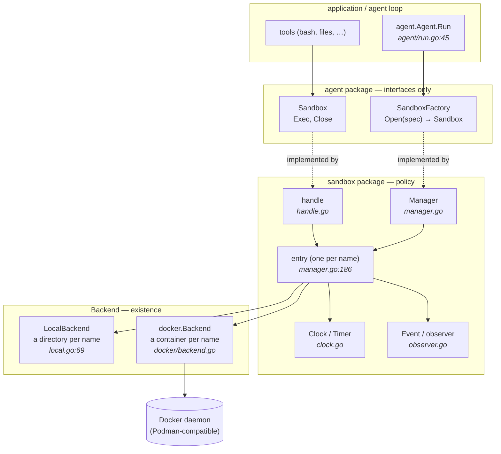

Two properties fall out of this shape and are worth checking hold everywhere:

1. `agent` depends on **no** sandbox implementation — only on `Sandbox` and
   `SandboxFactory` (`agent/sandbox.go:31,39`). The Docker SDK is imported by
   `sandbox/docker` and nothing else.
2. `Backend` **decides nothing**. Idle policy, serialization and timers live
   above it (`backend.go:9-14`). A new backend is five methods, no policy.

## 3. Types and contracts

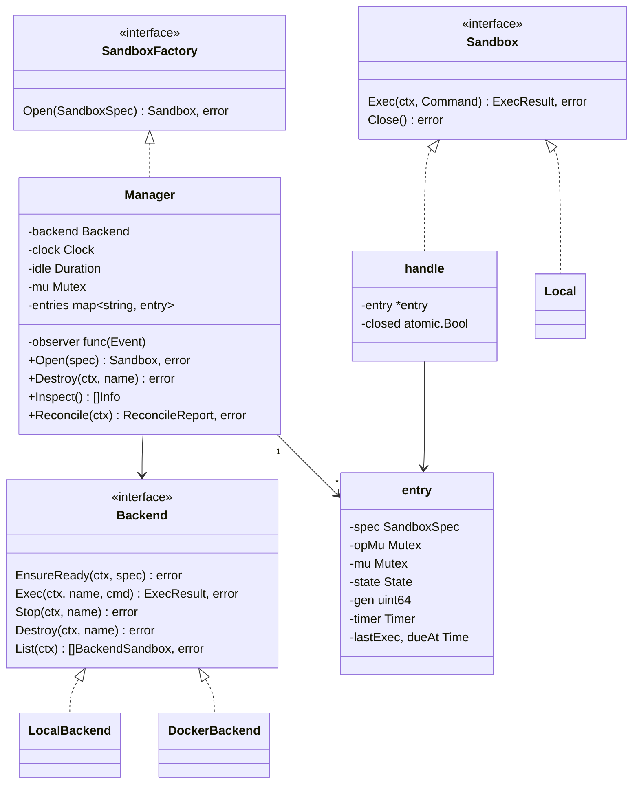

The contract that makes the whole thing predictable is the **error/exit-code
split**, repeated identically in `Local.Exec`, `LocalBackend.Exec` and
`docker.Backend.Exec`:

| Outcome | Return |
| --- | --- |
| command ran, exited 0 | `ExecResult{ExitCode: 0}`, `nil` |
| command ran, exited non-zero | `ExecResult{ExitCode: n}`, `nil` |
| command never ran, or its outcome can't be established | zero `ExecResult`, non-nil error |

The agent loop treats a non-nil error as fatal infrastructure failure, so the
line matters: a failing `grep` must never look like a broken sandbox.

Idempotency is the other half of the `Backend` contract (`backend.go:15-16`):
`EnsureReady`, `Stop` and `Destroy` are idempotent *with respect to the state
they ask for*; `Exec` is not. "Already gone" is success for `Stop` and `Destroy`.

## 4. Manager state machine

`State` (`state.go`) has four resting states and four that mean "one backend call
is in flight".

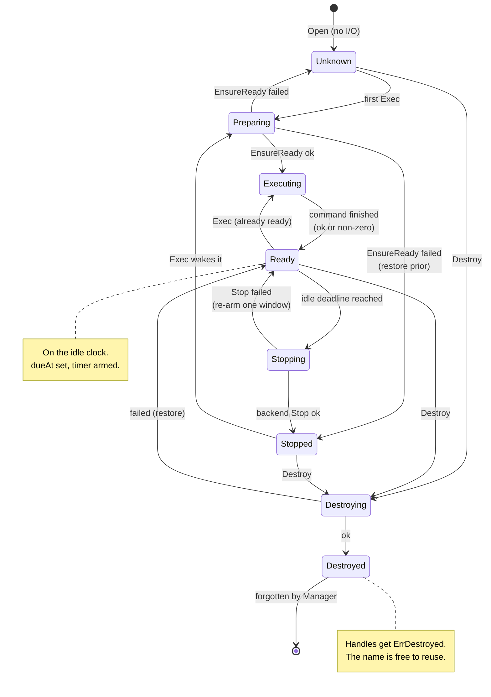

Resting vs. in-flight is not decoration — `Inspect` reads committed state only
(`manager.go:94`), so `preparing` / `executing` are what an operator sees while a
backend call is outstanding.

## 5. Concurrency: two locks, three rules

`entry` holds two mutexes with sharply different scopes (`manager.go:186-202`).

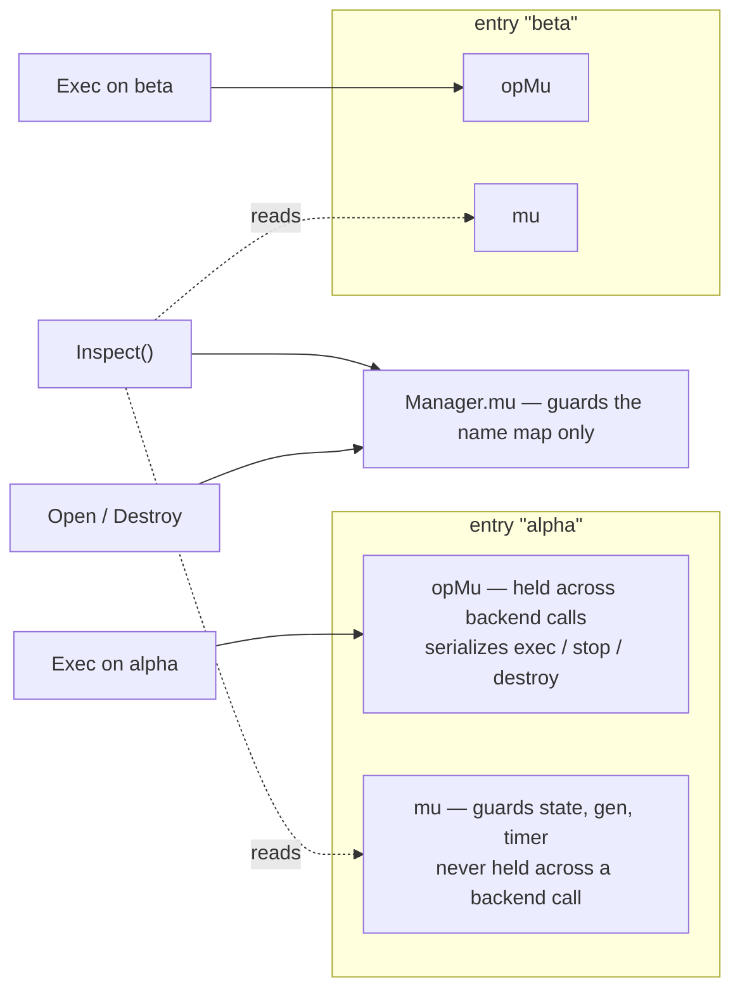

The three rules to hold the line on in review:

1. **`Manager.mu` guards the lookup and nothing else** (`manager.go:35`) — a slow
   backend call on one sandbox never blocks opening or inspecting another.
   Covered by `TestSandboxesRunIndependently`, `TestInspectStaysResponsiveDuringCommand`.
2. **`opMu` is held across backend calls** — this is the *only* thing serializing
   work per sandbox, and also what orders events. Covered by
   `TestCommandsSerializePerSandbox`, `TestDestroyWaitsForRunningCommand`.
3. **`mu` is never held across a backend call** — hence the `begin*` / `end*`
   pairs (`beginExec`/`endExec`, `beginStop`/`endStop`, `beginDestroy`). Any new
   operation must follow the same shape.

## 6. The idle policy

A sandbox goes on the idle clock whenever it comes to rest in `Ready`. The
subtlety is the **generation counter**: a fired timer must not stop a sandbox
that was used while the timer was in flight.

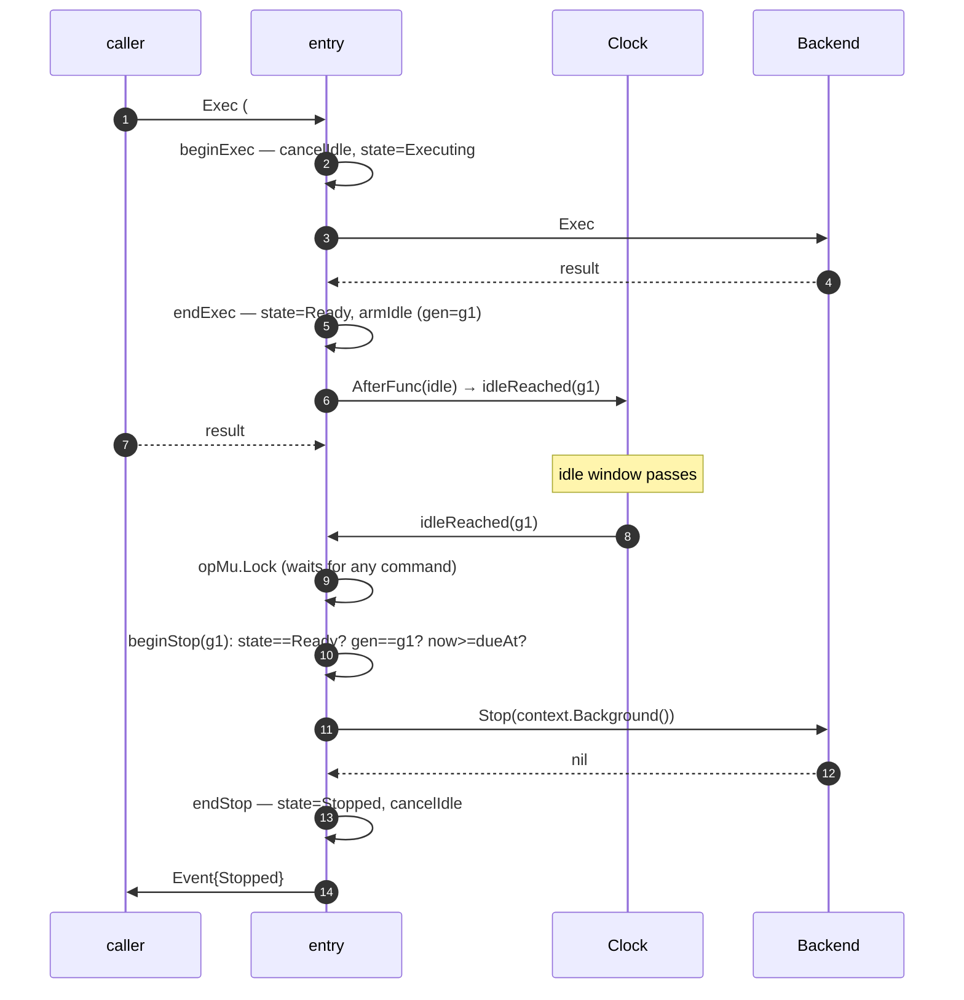

And the stale case, which is the reason `gen` exists at all:

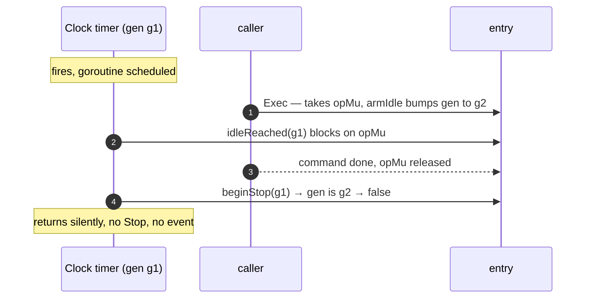

Three consequences encoded in the code:

- an idle stop uses `context.Background()` — nobody is waiting on it
  (`manager.go:266`);
- a failed stop leaves the sandbox in `Ready` and gives it **one full idle
  window** before retrying, rather than a tight loop (`endStop`, `manager.go:289`);
- `WithIdleTimeout(0)` (or negative) disables stopping entirely (`armIdle`,
  `manager.go:371`).

## 7. Reconciliation after a restart

A restarted harness starts from an empty belief. `Reconcile` replaces that with
ground truth, and **changes nothing on the backend**.

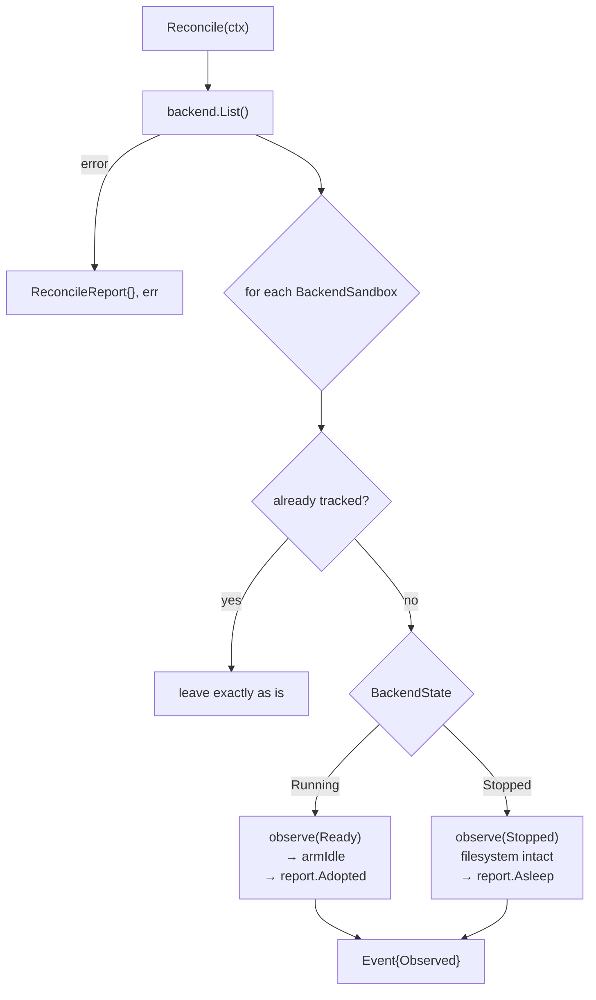

The load-bearing detail: compute someone left running is put on the idle clock,
which **bounds a crash's leftovers to one idle window** rather than forever
(`manager.go:126-134`, `TestReconciledSandboxStopsAfterOneIdleWindow`).

## 8. Events

`Inspect` answers "what is true now"; events answer "what just changed, as it
changes" (`observer.go:3-12`). They exist for the transitions no caller can see:
an idle stop has no caller, and a prepare can mean pulling an image long before
the first command returns.

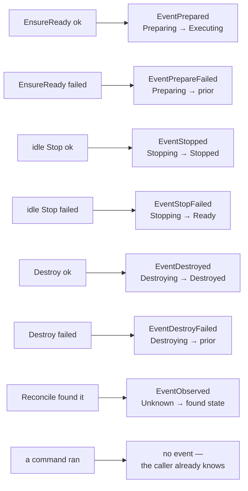

`From`/`To` mean a failure says not just *that* it failed but *where the sandbox
was left*, which is where the next command starts from.

The callback contract (`observer.go:74-88`) is the part most likely to be misused
by application code:

- it runs on the transitioning goroutine, after commit, with **no state or map
  lock held** — so it may call `Inspect`;
- but the sandbox's **`opMu` is still held, deliberately**, which is what orders
  events per sandbox. So an observer must **not** call `Exec` or `Destroy` on the
  sandbox it is being told about — that self-deadlocks;
- it must not do slow work: an idle stop waits for it, and a prepare is on the
  path of the command that triggered it.

## 9. The Docker backend

One sandbox is one long-lived container, named `metaharness-sandbox-<name>` and
labelled `metaharness.sandbox=<name>`.

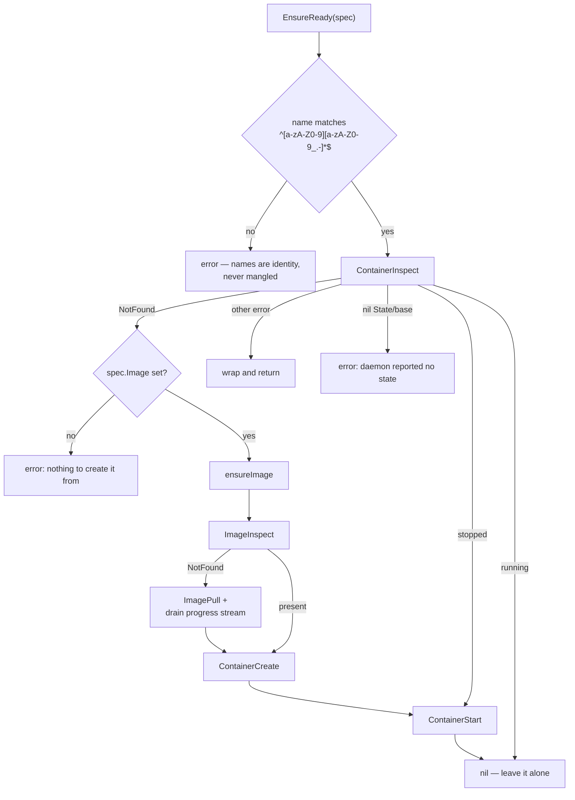

Design decisions and why:

| Decision | Where | Why |
| --- | --- | --- |
| Existing container is **started, never recreated** | `backend.go` `EnsureReady` | recreating takes the filesystem with it |
| Filesystem = container's writable layer | package doc | stopping costs nothing; only `Destroy` removes work |
| Keepalive `tail -f /dev/null` as `Entrypoint` | `defaultKeepalive()` | `sleep infinity` is GNU-only — busybox `sleep` exits and takes the sandbox with it. Replacing the entrypoint is deliberate: a sandbox exists to run commands on request |
| `StopTimeout: 0` at create **and** at `Stop` | `create`, `Stop` | the keepalive is PID 1 with no signal handler, so the kernel never delivers SIGTERM; a graceful timeout would always be spent in full. Setting it on the container makes even a hand-run `docker rm -f` immediate |
| Ownership = the **label**, not the name prefix | `List` | a container that merely shares the naming convention is left alone |
| `daemon` interface, not `*client.Client` | `backend.go:65` | the backend is testable without a daemon |
| Name prefix supplies Docker's required leading character | `namePrefix` | a sandbox name only has to be legal from its second character on |

Exec is the fiddliest part, because the exit status is only final once output has
ended, and because a read blocked on the daemon does not notice a context.

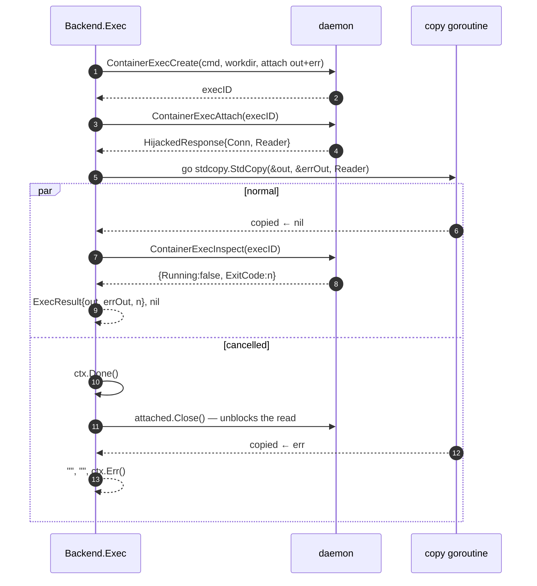

Two invariants here:

- `ContainerExecInspect` happens **after** the stream is drained, not alongside
  it; `Running: true` at that point is reported as an error rather than a guessed
  exit code (`executor.go:49-51`);
- on cancellation the code closes the connection *and then waits for the copy to
  return*, so the buffers are nobody else's business — this is what keeps the
  race detector quiet.

`stdcopy.StdCopy` is what separates the two streams the daemon interleaves down
one connection; tests cover output split across frames and output larger than one
read.

## 10. The local backend

`Local` and `LocalBackend` are the development path, and the doc comment is blunt
about it: **not a sandbox in any security sense** — no isolation, no limits, and
`cd ..` or an absolute path escapes `Dir` trivially (`local.go:20-26`). `Dir` only
sets where commands start.

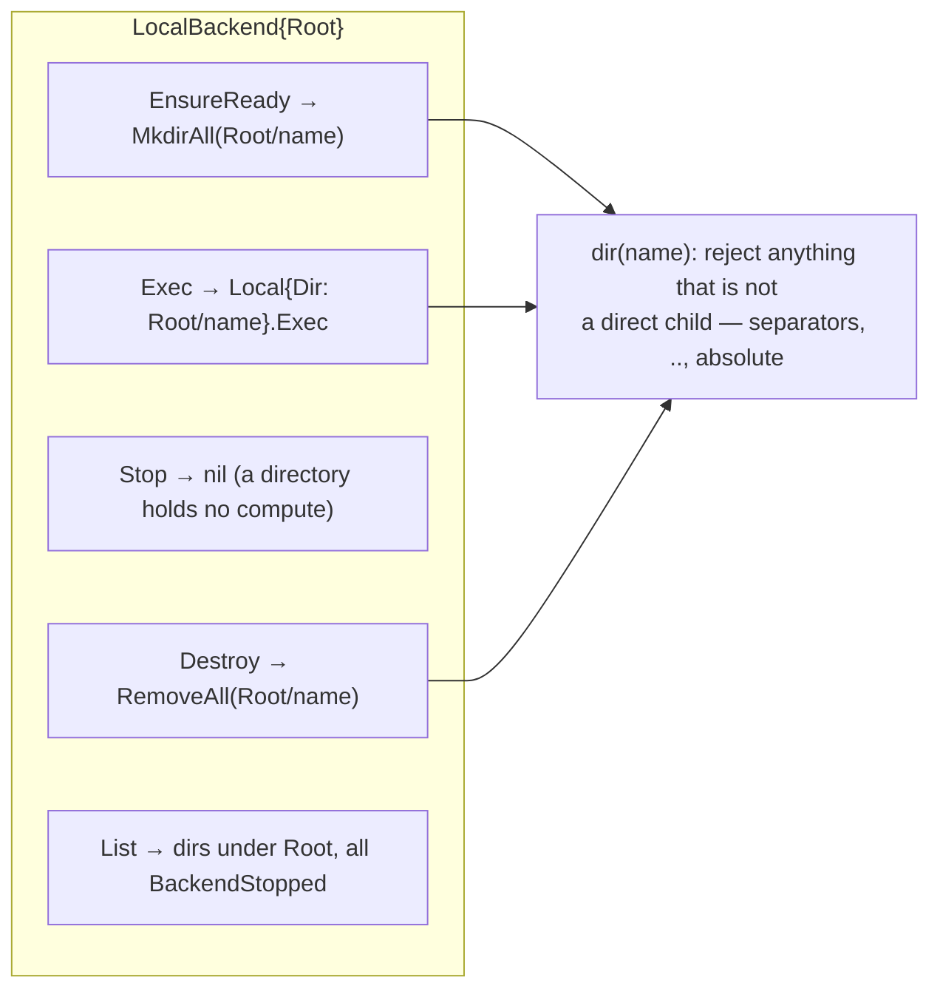

`dir()` is the security-relevant line: a name that could point anywhere other
than a direct child of `Root` is **rejected rather than resolved**
(`local.go:133-142`, `TestLocalBackendRejectsNamesThatEscapeRoot`) — the same
posture as the Docker name regex.

## 11. Test strategy

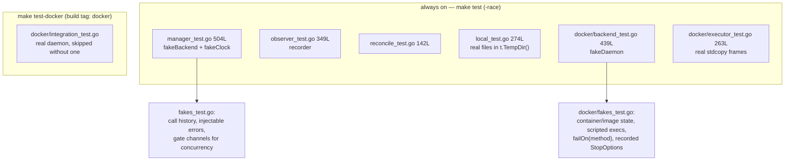

The two seams that make this testable are worth protecting:

- **`Clock`** (`clock.go`) — the idle policy is tested by *advancing time and
  asserting*, never by sleeping. `fakeClock.Advance` runs due timers.
- **`daemon`** (`docker/backend.go:65`) — the smallest slice of the Docker SDK the
  backend needs, so the Docker backend has real unit tests instead of only
  integration ones.

Tests are named after behaviour, not methods
(`TestIdleStopReleasesComputeAndKeepsSandbox`,
`TestSandboxSurvivesStopAndWake`, `TestManagedSandboxOutlivesTheProcess`), which
matches the project's TDD rule and means the suite reads as the specification of
the contracts in §3.

## 12. Notes for the reviewer

Verified observations, roughly in descending order of how much they'd cost later.

1. **No `Manager.Close` / shutdown path.** There is no way to drain or cancel
   armed idle timers, and an idle stop runs on `context.Background()` with no
   handle to wait on (`manager.go:266`) — a process that exits mid-stop leaves
   the container running until the next `Reconcile` re-arms it. Nothing releases
   the backend either: `docker.Backend.Close()` exists (`backend.go:126`) but the
   manager never calls it and has no lifecycle of its own.
2. **`WithKeepalive`'s doc comment is stale.** It says "the default,
   `sleep infinity`, is not in every image", but the default is
   `tail -f /dev/null` (`defaultKeepalive()`), and the package comment explains at
   length *why* it isn't `sleep infinity`. The comment contradicts the code two
   functions above it.
3. **No resource limits or network policy in the Docker backend.** `create`
   passes `&container.HostConfig{}` — default network (full egress), no memory or
   CPU cap, no pids limit, no read-only paths, and whatever user the image
   defaults to (usually root). For a component called
   "sandbox" running model-authored commands, the absent knobs are worth an
   explicit decision + doc line, even if the answer is "later".
4. **Exec output is fully buffered in memory**, in both backends
   (`bytes.Buffer` in `executor.go` and `local.go`). A command that prints a
   gigabyte takes the process with it. No cap, no truncation, no streaming.
5. **`armIdle` bumps `gen` twice** — it calls `cancelIdle` (which bumps) and then
   bumps again (`manager.go:369-379`). Harmless, since only inequality matters,
   but it reads as if one of the two increments is a leftover.
6. **`Backend.container` as a method name** (`docker/backend.go:276`) sits next to
   the imported `container` package used heavily in the same file. It resolves
   fine — methods aren't bare identifiers — but it's a coin-flip of confusion for
   the next reader, and it has exactly one caller (`containerName`).
7. **A second `Open` with a different `Image` is silently ignored.** First spec
   for a name wins (`entryFor`/`adopt`, `manager.go:154-167`). This is documented
   on `agent.SandboxSpec` and is the right semantics, but it is silent — no event,
   no error — so a caller who bumped the image and sees the old one has nothing to
   go on.
8. **`Reconcile` is opt-in and undocumented outside the code.** Nothing in
   `README.md`/`STACK.md` tells an application author that they must call it at
   startup, and skipping it means leaked compute stays leaked. Worth a line in the
   package doc or STACK.md.
9. **`LocalBackend.List` reports everything as `BackendStopped`**, so a reconciled
   local sandbox is always `Asleep`. Correct (a directory has no compute) but it
   means the `Adopted` path is only ever exercised against Docker and fakes.
10. **`handle` has no reference counting** — `Close` sets a flag and nothing else,
    by design (`handle.go:15,28-31`). So nothing anywhere knows how many callers
    are live; idle time is the only signal. That's a deliberate simplification and
    the tests pin it (`TestCloseIsLifecycleNeutral`,
    `TestHandlesShareOneSandbox`) — just be aware there is no "last user left"
    hook to hang anything on.
