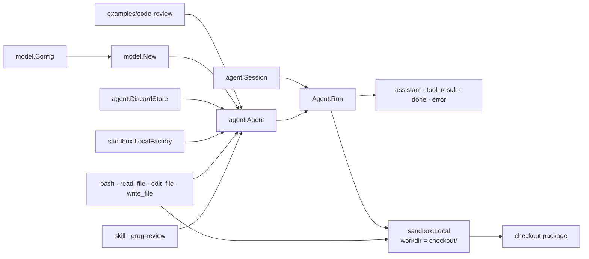

# Code Review Agent Demo

This is the smallest complete picture of Meta Harness today: an application
assembles a model, store, sandbox, and tools into an `agent.Agent`, then runs
one mutable `agent.Session` through the model/tool loop.



## Assembly

The example owns the concrete dependencies; the core agent owns the loop.

```go
m, _ := model.New(model.Config{
    Provider: model.ProviderAnthropic,
    APIKey:   os.Getenv("ANTHROPIC_API_KEY"),
})

a := agent.New(systemPrompt,
    agent.WithModel(m),
    agent.WithStore(agent.DiscardStore{}),
    agent.WithSandbox(sandbox.LocalFactory{Root: workdir}),
    agent.WithTools(
        agent.Adapt(tools.Bash{}),
        agent.Adapt(tools.ReadFile{}),
        agent.Adapt(tools.EditFile{}),
        agent.Adapt(tools.WriteFile{}),
        tools.NewSkill(skills.GrugReview()),
    ),
)
```

`agent.Adapt` derives each typed tool's JSON schema, exposes it to the model,
validates tool-call arguments, and then invokes the typed Go implementation.

```text
TypedTool[T] -> Adapt[T] -> agent.Tool -> model tool schema
                                      -> validated T -> Execute(...)
```

The skill is a normal tool. Calling `skill` puts the `grug-review`
instructions into the transcript; the next model turn follows them.

```text
skill({"skill":"grug-review"})
  -> <skill_content name="grug-review">...</skill_content>
  -> appended as a tool-result message
```

## Session and run

```go
sess := &agent.Session{
    ID:       fmt.Sprintf("review-%d", time.Now().Unix()),
    Model:    modelID,
    Messages: []model.Message{model.NewUserMessage(prompt)},
    Status:   agent.StatusActive,
}

events, err := a.Run(ctx, sess)
for event := range events {
    // Print assistant/tool activity, completion, or failure.
}
```

```mermaid
sequenceDiagram
    participant App as code-review
    participant Agent as agent.Run
    participant Model as FantasyModel / Anthropic
    participant Tool as selected tool
    participant Box as sandbox.Local
    participant Store as DiscardStore

    App->>Agent: Run(ctx, session)
    Agent->>Box: Acquire(session.Sandbox)

    loop Until assistant returns without tool calls
        Agent->>Model: Generate(system prompt, transcript, tool schemas)
        Model-->>Agent: assistant text and/or tool calls + usage
        Agent->>Store: Save(session)
        opt Assistant requested tools
            Agent->>Tool: Execute(validated arguments, ExecCtx)
            opt Filesystem or shell tool
                Tool->>Box: Exec(command)
                Box-->>Tool: stdout, stderr, exit code
            end
            Tool-->>Agent: tool result
            Agent->>Agent: append result to transcript
            Agent->>Store: Save(session)
        end
    end

    Agent->>Agent: status = completed
    Agent->>Store: Save(session)
    Agent-->>App: EventDone
    Agent->>Box: Close()
```

`DiscardStore.Save` succeeds without retaining checkpoints, so the live
session is the only transcript. Applications can replace it with `JSONLStore`
through `agent.WithStore` when persistence is wanted.

```text
Session = ID + model ID + fantasy messages + token usage + status + sandbox spec
```

`sandbox.Local` only sets the process working directory. It is deliberately a
development adapter, not security isolation: commands can access the host and
escape `workdir` with absolute paths or `..`.

## Run it

From this folder:

```sh
export ANTHROPIC_API_URL=https://api.anthropic.com/
export ANTHROPIC_API_KEY=...
go run .
```

You can provide these flags to change the defaults without touching code:

```text
-model    Anthropic model id       (default: gemma4:31b-cloud)
-workdir  tool working directory   (default: checkout)
-prompt   initial user message     (there is a default one too)
```

The [`checkout/`](checkout/) package is intentionally imperfect and has its
own `go.mod`. Its failing quantity-validation test remains outside the root
test suite while giving the review agent concrete signal to find.
